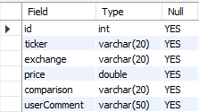

# crypto-alerts-discord-bot

A Discord bot that allows users to create & manage cryptocurrency price alerts and be notified when an alert is set off. Alerts can be stored in and retrieved from a MySQL database. The bot also allows you to query prices and supports multiple exchanges.

### Installing + running

To clone, build and run this project:
```
git clone https://github.com/toastercoder/crypto-alerts-discord-bot.git
cd crypto-alerts-discord-bot/CryptoDiscordBot/CryptoDiscordBot
dotnet build
dotnet run <config file path>
```


### Config file
To run the bot, there are multiple parameters that must be specified. The path to the config text file should be supplied as a command line argument, or if no argument is passed, the program will prompt the user to enter the path to the file at runtime. 

The config file specifies the following parameters:

```
Discord Bot Token - The token generated for the Discord bot
Discord Server ID - The ID of the server for the bot to interact with
Discord Channel ID - The ID of the channel that the bot will send alert messages to
Database Server URL - The hostname of the MySQL database to make the connection to
Database Port - The port of the MySQL database to connect to
Database Name - The name of the database that contains the table
Database Table - The name of the table that alert records are stored
Database User - The username to connect to the database with
Database Password - The password to the database user
```
The `Discord bot token` can be generated from the [Discord Developer Portal](https://discord.com/developers/applications).

The Discord parameters are required and must be supplied for the bot to connect. The database parameters are optional, and can either be not supplied, or left empty, in the config file, if you don't want the bot to store/retrieve the alerts from the database.

An example config file that contains both Discord parameters and the MySQL database parameters can be found in [the repo here.](https://github.com/toastercoder/crypto-alerts-discord-bot/blob/master/config.txt)


### Database storage
A MySQL database can be used for persistent storage. Alerts will be stored in the database and retrieved from the database at startup. The usage of a database is optional. 

To use a database, supply the database parameters in the config file. If you don't want to use a database, and just want the alerts to be stored in memory while the program executes, then leave the database config values blank.

The schema of the database table where alerts are stored from should be as follows:




### Discord commands
```
!add <exchange> <ticker> <price> <comment> - Adds an alert for the specified parameters. E.g. "!add bittrex btc-eth 0.5 yay"
!remove <id> - Removes the alert specified by its ID
!list - Lists all of the current untriggered alerts that have been added
!getprice exchange ticker - Gets the current price of the market specified
!help - Shows all available commands
```

### Supported exchanges
* Binance
* Bitfinex
* Bitmex
* Bittrex
* Kucoin
